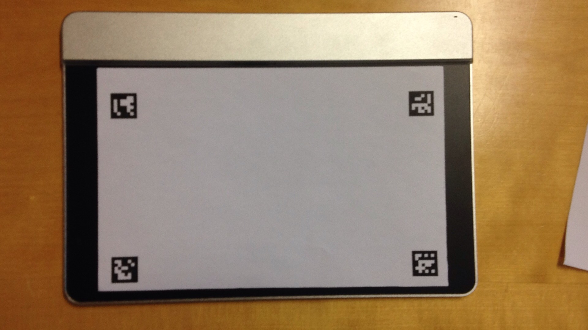
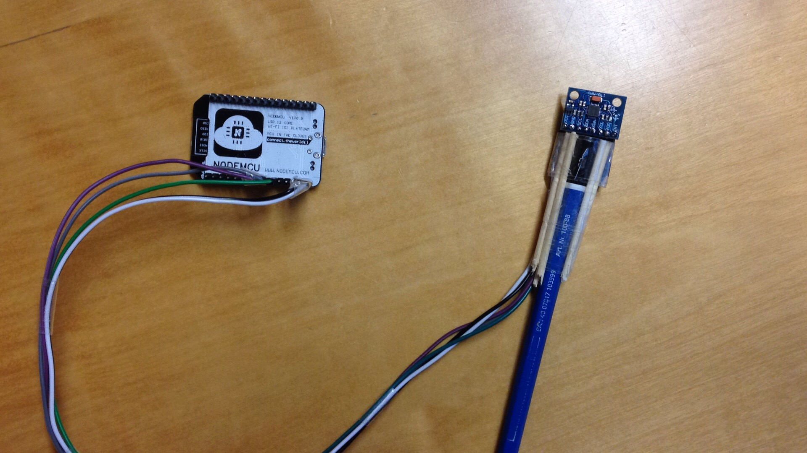

# Digital drawing with sensel

###Structure
```
|-- aruco_markers
|   |-- aruco_marker.py
|   `-- generate_aruco_marker.ipynb
|-- collecting_textures
|   |-- animation_of_pixels
|   |-- camera_cal
|   |-- centroids
|   |-- curves
|   |-- images
|   |-- images_with_centroids
|   |-- images_with_resampled_patches
|   |-- pixels
|   |-- processed_images
|-- dataset
|   |-- animation_pixels.py
|   |-- classification
|   |   |-- merged_images
|   |   |-- paras
|   |   `-- textures
|   |-- image_with_patches
|-- generate_paras
|   |-- inputs
|   |-- modified_inputs
|-- reconstruct_stroke
|   |--reconstruct_stroke_with_eqdist_by_clustering_paras
|   |--reconstructed_strokes_with_eqdist_by_search
|-- Graphite-Pencil
|-- GAN
```
###Sensel Morph Tablet 

###Pencil with gyro and ESP board

